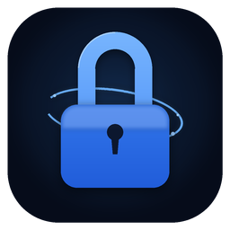

<div align="center">



# The LockShed

**A private, local password manager. No cloud, no subscription, no account.**

[](https://github.com/yalkatrazz/lockshed/releases/latest)
[](https://github.com/yalkatrazz/lockshed/releases/latest)
[](LICENSE)
[](https://github.com/yalkatrazz/lockshed/releases/latest)

[**⬇ Download for Windows**](https://github.com/yalkatrazz/lockshed/releases/latest/download/LockShed-Setup.exe) · [Website](https://yalkatrazz.github.io/lockshed/) · [Full documentation](README.txt)

</div>

---

<!--
  Add a real screenshot or short GIF of the app here before publishing -
  it sells the project far better than any amount of text. A quick way:
  Win+G (Xbox Game Bar) to record a 10-second clip of adding an entry
  and autofilling it in the browser, or just a clean screenshot of the
  main window. Save it as e.g. docs/screenshot.png and uncomment below.

  
-->

The LockShed encrypts your passwords, notes, and sensitive information **entirely on your own computer**. Nothing is ever uploaded anywhere - not for backup, not for sync, not for "analytics". You own the file, you own the key.

## Why

Most password managers ask you to trust a company's cloud servers with the one file that unlocks your entire digital life. The LockShed is the opposite bet: everything - encryption, storage, autofill, mobile access - happens over infrastructure you already control (your own PC, your own WiFi). If you're comfortable reading Python, you can verify every claim below yourself; the whole thing is open source.

## Features

- 🔒 **AES-256-CBC + HMAC-SHA256** encryption (encrypt-then-MAC) for every entry, with PBKDF2 (600k iterations) key derivation
- 📊 **Built-in password strength analysis** (zxcvbn) - not just a length check
- 🧩 **Browser extension** (Brave/Chrome) for one-click autofill, paired via a per-install random secret - no site can ever read your vault, only the extension itself
- 📱 **Mobile access over your own WiFi** - a PIN-protected PWA, no app store, no third-party server involved
- ⏱ **Auto-lock & password history** - the vault locks itself when idle and remembers previous passwords per entry
- 📄 **PDF export & CSV import** for backups and migrating from other managers
- 🎨 **Multiple themes**, drag-and-drop custom categories, adjustable font scaling

## Installation

1. Download `LockShed-Setup.exe` from the [latest release](https://github.com/yalkatrazz/lockshed/releases/latest)
2. Run it. Windows SmartScreen will show an "unknown publisher" warning the first time - this is expected (the installer isn't code-signed, a paid certificate isn't in the budget for a hobby project); click **More info → Run anyway**
3. Launch The LockShed from the Start Menu and set a master password

Full setup instructions (mobile access, browser extension pairing, backups, troubleshooting) are in [`README.txt`](README.txt), also bundled inside the installed app.

## Building from source

```
git clone https://github.com/yalkatrazz/lockshed.git
cd lockshed
installera.bat   # installs Python dependencies
starta.bat       # runs the app
```

Want to build your own `Setup.exe`? See the **"Building a Windows Installer"** section in [`README.txt`](README.txt) - `build.bat` handles PyInstaller + Inno Setup end to end.

## Security

- Encryption: AES-256-CBC with an HMAC-SHA256 authentication tag (encrypt-then-MAC), PBKDF2-SHA256 with 600,000 iterations for key derivation, constant-time comparisons throughout
- The browser extension talks to the app over `localhost` only, authenticated by an origin check plus a per-install random pairing secret - never a hardcoded shared secret
- Mobile access is opt-in (off by default), rate-limited against PIN guessing, and uses short-lived session tokens rather than resending your PIN on every request
- The vault refuses to serve any data while locked, even to an already-paired extension

This is a hobby project, not an audited commercial product - read the code, don't just take my word for it.

## License

[MIT](LICENSE) - do whatever you want with it.

---

<div align="center">
<sub>If The LockShed is useful to you, consider <a href="https://paypal.me/paddesan">buying me a coffee</a> ☕</sub>
</div>
